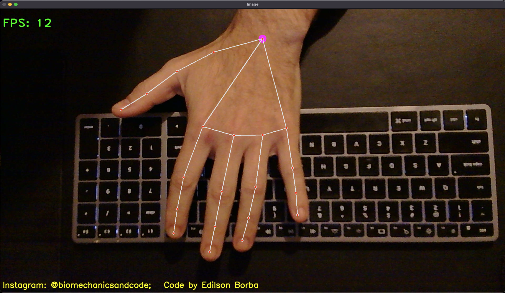

# Hand Detection with Mediapipe

This Python script uses **OpenCV** and **Mediapipe** to detect and track hand landmarks in real-time. It can work with a webcam or video files as input, providing detailed information about hand movements and landmarks.

---

## Features

- Real-time hand detection using Mediapipe's Hands solution.
- Displays hand landmarks and connections on the video feed.
- Calculates and displays FPS (Frames Per Second).

---

## Requirements

Ensure you have the following installed:

- Python 3.7+
- OpenCV 4.5+
- Mediapipe 0.8+

To install the necessary libraries, run:

```bash
pip install opencv-python mediapipe
```

---

## How to Use

1. Clone or download the script.
2. Ensure your camera is connected, or replace the `0` in `cap = cv2.VideoCapture(0)` with the path to a video file.
3. Run the script:

```bash
python hand_detection.py
```

4. Press `q` to quit the application.

---

## Code Highlights

### Hand Detection
The script uses Mediapipe's **Hands** solution to detect and draw landmarks on the hand. It calculates the position of each landmark relative to the video frame and draws a circle on the landmark ID `0` (base of the thumb).

### FPS Calculation
FPS is calculated dynamically to monitor the performance:

```python
fps = 1 / (cTime - pTime)
pTime = cTime
```

---

## Example Output

- Hand landmarks connected by lines.
- FPS displayed in the top-left corner.
- Custom message displayed in the bottom-left corner.




---

## Author

Developed by **Edilson Borba**.

Follow us on Instagram: [@biomechanicsandcode](https://www.instagram.com/biomechanicsandcode)

---

## License

This project is licensed under the MIT License. Feel free to use and modify it for personal or educational purposes.

